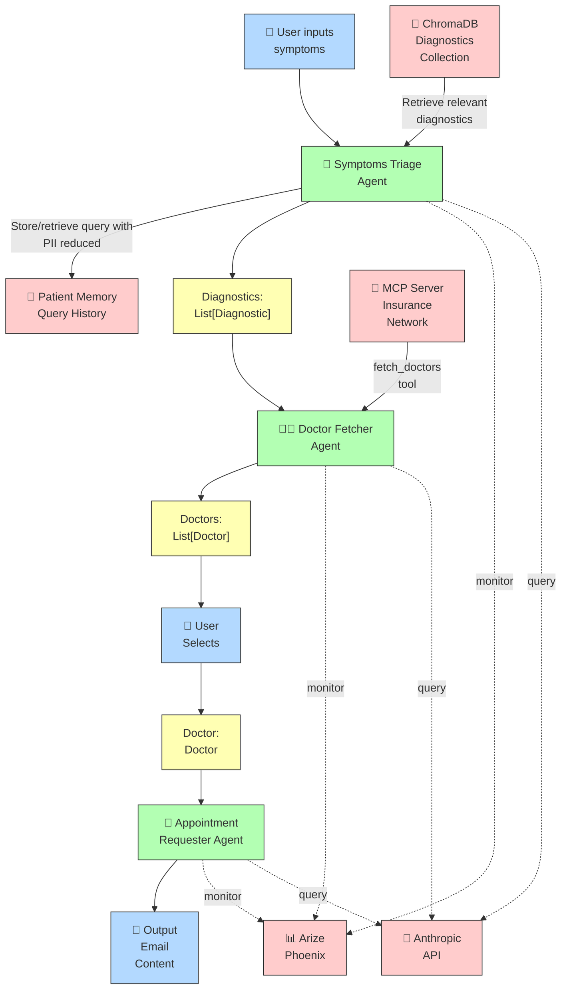

```mermaid
graph TD
    UserInput["👤 User inputs <br/>symptoms"]
        
    STAgent["🏥 Symptoms Triage<br/>Agent"]
    DiagnosticsOutput["Diagnostics:<br/>List[Diagnostic]"]
    
    DFAgent["👨‍⚕️ Doctor Fetcher<br/>Agent"]
    DoctorsOutput["Doctors:<br/>List[Doctor]"]
    
    UserSelect["👤 User<br/>Selects"]
    DoctorOutput["Doctor:<br/>Doctor"]
    
    ARAgent["📧 Appointment<br/>Requester Agent"]
    
    FinalOutput["📨 Output<br/>Email<br/>Content"]
    
    ChromaDB["💾 ChromaDB<br/>Diagnostics<br/>Collection"]
    PatientMemory["📝 Patient Memory<br/>Query History"]
    MCPServer["🔌 MCP Server<br/>Insurance<br/>Network"]
    Phoenix["📊 Arize<br/>Phoenix"]
    AnthropicAPI["🤖 Anthropic<br/>API"]
    
    UserInput --> STAgent
    
    ChromaDB -->|"Retrieve relevant<br/>diagnostics"| STAgent
    STAgent -->|"Store/retrieve query with<br/>PII reduced"| PatientMemory
    STAgent --> DiagnosticsOutput
    
    DiagnosticsOutput --> DFAgent
    MCPServer -->|"fetch_doctors<br/>tool"| DFAgent
    DFAgent --> DoctorsOutput
    
    DoctorsOutput --> UserSelect
    UserSelect --> DoctorOutput
    
    DoctorOutput --> ARAgent
    ARAgent --> FinalOutput
    
    STAgent -.->|"monitor"| Phoenix
    DFAgent -.->|"monitor"| Phoenix
    ARAgent -.->|"monitor"| Phoenix
    
    STAgent -.->|"query"| AnthropicAPI
    DFAgent -.->|"query"| AnthropicAPI
    ARAgent -.->|"query"| AnthropicAPI
    
    classDef userNode fill:#b3d9ff,stroke:#333
    classDef agentNode fill:#b3ffb3,stroke:#333
    classDef dataNode fill:#ffffb3,stroke:#333
    classDef externalNode fill:#ffcccc,stroke:#333
    classDef processNode fill:#e6ccff,stroke:#333
    
    class UserInput,UserSelect,FinalOutput userNode
    class STAgent,DFAgent,ARAgent agentNode
    class DiagnosticsOutput,DoctorsOutput,DoctorOutput dataNode
    class ChromaDB,PatientMemory,MCPServer,Phoenix,AnthropicAPI externalNode
    class InitPhoenix,Question processNode
```
