# Doctor Advisor

## Introduction

This project demonstrates a **multi-agent AI system** that helps people with medical insurance get personalized doctor recommendations and appointment templates. The workflow is:

1. **Patient provides symptoms** → The system requests the patient to introduce their symptoms and stores the query
2. **Symptoms Triage Agent** → Analyzes symptoms and generates a list of relevant diagnostics using retrieval-augmented generation (RAG)
3. **Doctor Fetcher Agent** → Matches diagnostics to doctors from the patient's insurance network
4. **Patient selects a doctor** → Interactive selection from recommended list
5. **Appointment Requester Agent** → Generates an email template ready to send to the selected doctor

The system main technologies are **Pydantic AI** for agent orchestration, **Pydantic Evals** for eval-driven development, and **Arize Phoenix** for runtime observability.

---

## Table of Contents

- [System Architecture](#system-architecture)
  - [Multi-Agent Orchestration](#multi-agent-orchestration)
  - [Agent Details](#agent-details)
  - [System Architecture Diagram](#system-architecture-diagram)
  - [Project Structure](#project-structure)
- [Tech Stack](#tech-stack)
- [Testing](#testing)
  - [Test Cases](#test-cases)
  - [Running Tests](#running-tests)
- [Running the Project](#running-the-project)
  - [Prerequisites](#prerequisites)
  - [Step 1: Install Dependencies](#step-1-install-dependencies)
  - [Step 2: Setup the Insurance Directory Database](#step-2-setup-the-insurance-directory-database)
  - [Step 3: Start Phoenix Observability](#step-3-start-phoenix-observability-optional-but-recommended)
  - [Step 4: Run the Agent System](#step-4-run-the-agent-system)
  - [Example Interaction](#example-interaction)
  - [Monitoring with Phoenix](#monitoring-with-phoenix)
- [Development Notes](#development-notes)
- [Known Limitations](#known-limitations)
- [Future Work](#future-work)

---

## System Architecture

### Multi-Agent Orchestration

The project implements a **sequential multi-agent pattern** where three specialized agents coordinate to solve a complex workflow:

```
User Input (Symptoms) 
  ↓
[Symptoms Triage Agent] → Diagnostics
  ↓
[Doctor Fetcher Agent] → Doctors
  ↓
[User Selection] → Chosen Doctor
  ↓
[Appointment Requester Agent] → Email Template
  ↓
User Output
```

#### Agent Details

**1. Symptoms Triage Agent** (`agents/symptoms_triage/`)
- **Purpose**: Extract relevant medical diagnostics from patient symptoms
- **Implementation**: Pydantic AI agent with Claude Sonnet 4.5
- **RAG Integration**: 
  - Embeds user queries using sentence transformers
  - Retrieves similar diagnostics from ChromaDB vector store
  - Augments LLM prompt with retrieved context for accuracy
- **Input**: Patient symptom description (string)
- **Output**: `List[Diagnostic]` with title, definition, and symptoms
- **Memory**: Stores de-identified patient queries in `patient_memories.json` (with PII redaction via Presidio)
- **Testing**: Eval-driven with Pydantic Evals (`agents/symptoms_triage/evals.py` uses `LLMJudge` and the `EqualsExpected` built-in evaluators)

**2. Doctor Fetcher Agent** (`agents/doctor_fetcher/`)
- **Purpose**: Match diagnostics to appropriate doctors from the patient's insurance network
- **Implementation**: Pydantic AI agent with Claude Sonnet 4.5
- **MCP Integration**: Uses Model Context Protocol to communicate with insurance server
  - Calls `fetch_doctors` tool via MCP stdio connection
  - Retrieves doctor list filtered by insurance coverage and specialization
- **Input**: `List[Diagnostic]` from symptoms triage agent
- **Output**: `List[Doctor]` with name, specialization, and email
- **Testing**: Eval-driven with Pydantic Evals (`agents/doctor_fetcher/evals.py` uses a `DoctorFieldsMatch` custom evaluator)

**3. Appointment Requester Agent** (`agents/appointment_requester/`)
- **Purpose**: Generate professional email content for appointment requests
- **Implementation**: Pydantic AI agent with Claude Sonnet 4.5
- **Input**: Original patient query + selected doctor details
- **Output**: Email template with placeholder for patient name and phone
- **Testing**: Eval-driven with Pydantic Evals (`agents/appointment_requester/evals.py` uses `LLMJudge` built-in evaluator)

### System Architecture Diagram



The diagram shows:
- **Agent pipeline** flowing from symptoms → diagnostics → doctors → email
- **External systems**: Anthropic API (LLM), ChromaDB (vector store), MCP insurance server
- **Observability**: Arize Phoenix traces all LLM calls with token counts and latency
- **Memory**: Patient query history with PII redaction for context awareness

### Project Structure

```
capstone/
├── README.md                          # This file
├── main.py                            # Agent orchestration entrypoint
├── pyproject.toml                     # Dependencies and project config
├── observability.py                   # Phoenix OTEL setup
├── system_architecture.svg            # Architecture diagram
│
├── agents/                            # Agent implementations
│   ├── __init__.py
│   │
│   ├── shared/
│   │   ├── __init__.py
│   │   └── models.py                  # Pydantic models: Diagnostic, Doctor
│   │
│   ├── symptoms_triage/
│   │   ├── __init__.py
│   │   ├── main.py                    # Symptoms triage agent
│   │   ├── utils.py                   # RAG: embedding, retrieval, augmentation
│   │   ├── memory.py                  # Patient memory management
│   │   ├── diagnostics.md             # Medical diagnostic knowledge base
│   │   ├── chroma_db/                 # ChromaDB persistent storage
│   │   ├── patient_memories.json      # De-identified patient query history
│   │   ├── evals.py                   # Pydantic Evals test cases (LLMJudge)
│   │   └── evals_memory.py            # Memory-specific evals
│   │
│   ├── doctor_fetcher/
│   │   ├── __init__.py
│   │   ├── main.py                    # Doctor fetcher agent
│   │   ├── mock_insurance_server.py   # Fallback insurance data
│   │   ├── evals.py                   # Pydantic Evals test cases (LLMJudge)
│   │   └── evals_memory.py            # Memory integration evals
│   │
│   └── appointment_requester/
│       ├── __init__.py
│       ├── main.py                    # Appointment request email generator
│       ├── utils.py                   # Doctor selection UI helper
│       └── evals.py                   # Pydantic Evals test cases (LJMJudge)
│
└── servers/                           # MCP server implementations
    ├── insurance_directory.py         # Insurance network MCP server
    ├── insurance_db.json              # Mock insurance provider database
    └── insurance_db.sql               # SQL schema for insurance data
```

**Key Files & Directories:**

| Path | Purpose |
|------|---------|
| `main.py` | Entry point: orchestrates all three agents in sequence |
| `agents/observability.py` | Initializes Arize Phoenix OTEL tracing for runtime monitoring |
| `agents/shared/models.py` | Pydantic models: `Diagnostic`, `Doctor`, `Speciality` enum |
| `agents/symptoms_triage/diagnostics.md` | Medical knowledge base (markdown) with definitions & symptoms |
| `agents/symptoms_triage/chroma_db/` | Persistent vector store of diagnostic embeddings |
| `agents/symptoms_triage/patient_memories.json` | Patient query history (PII-redacted) for context |
| `agents/*/evals.py` | Pydantic Evals test suites (LLMJudge for semantic evaluation) |
| `servers/insurance_directory.py` | MCP server providing doctor/insurance data via stdio |

---

## Tech Stack

### Core Framework & AI
- **[Pydantic AI](https://docs.pydantic.dev/latest/concepts/agents/)** — Lightweight agent framework with type-safe tool use and structured outputs
- **[Claude (Anthropic)](https://www.anthropic.com/)** — Claude Sonnet 4.5 model powers all three agents
- **[Pydantic](https://docs.pydantic.dev/)** — Data validation and structured outputs for all agent inputs/outputs

### Retrieval-Augmented Generation (RAG)
- **[ChromaDB](https://www.trychroma.com/)** — Vector database for diagnostic embeddings and semantic search
- **[Sentence Transformers](https://www.sbert.net/)** — `all-MiniLM-L6-v2` model for embedding patient symptoms and diagnostics
- **[LangChain Text Splitters](https://python.langchain.com/)** — Chunking diagnostics for optimal vector retrieval

### Testing & Evaluation
- **[Pydantic Evals](https://github.com/pydantic/evals)** — Eval-driven development framework
  - `LLMJudge` evaluator for semantic correctness of agent outputs
  - `EqualsExpected` evaluator for deterministic cases (empty lists)

### Observability
- **[Arize Phoenix](https://phoenix.arize.com/)** — Open-source LLM observability platform
  - `arize-phoenix-otel` — OTEL integration for trace collection
  - `openinference-instrumentation-anthropic` — Traces all Anthropic SDK calls (used by pydantic-ai internally)
  - Real-time visibility into LLM tokens, latency, and tool use

### Data Privacy & Security
- **[Presidio](https://microsoft.github.io/presidio/)** — PII detection and anonymization
  - `presidio-analyzer` — Detects emails, phone numbers in patient queries
  - `presidio-anonymizer` — Redacts PII before storing in memory
- **[Email Validator](https://github.com/JoshData/python-email-validator)** — Email validation for appointment requests

### Integration & Protocol
- **[MCP (Model Context Protocol)](https://modelcontextprotocol.io/)** — Standardized interface for agent-server communication
  - Used to integrate insurance provider directory (realised as a [SQLite](https://sqlite.org/index.html) database) as a tool for the doctor fetcher agent

### Development & Package Management
- **[UV](https://astral.sh/uv/)** — Fast Python package manager and task runner
- **Python 3.13** — Modern Python for type hints and async/await

---

## Testing

This project uses **Pydantic Evals** with **eval-driven development**: agents are tested with LLM-based evaluation (LJMJudge) to validate semantic correctness rather than exact field matching.

### Test Cases

Each agent has its own test suite evaluating:
- **Happy paths**: Known symptoms → correct diagnostics/doctors
- **Shared concepts**: Symptoms appearing in multiple diagnostics
- **Edge cases**: Nonexistent symptoms → empty results
- **Case sensitivity**: Uppercase queries handled correctly
- **Multi-symptom convergence**: Multiple symptoms narrowing to single result

### Running Tests

Run all tests for a specific agent:

```bash
# Test Symptoms Triage Agent
uv run python -m agents.symptoms_triage.evals

# Test Doctor Fetcher Agent
uv run python -m agents.doctor_fetcher.evals

# Test Appointment Requester Agent
uv run python -m agents.appointment_requester.evals
```

Each test runs through the agent's logic and uses `LLMJudge` to evaluate outputs semantically. The evaluator checks:
- **Symptoms Triage**: Output contains relevant diagnostics with correct definitions
- **Doctor Selector**: Output contains appropriate doctors from insurance network
- **Appointment Requester**: Output is a well-formed email template

---

## Running the Project

### Prerequisites
- Python 3.13
- `uv` package manager (install via `curl -LsSf https://astral.sh/uv/install.sh | sh`)

### Step 1: Install Dependencies

```bash
uv sync
```

This installs all dependencies from `pyproject.toml` including:
- Pydantic AI and Evals
- ChromaDB and Sentence Transformers (for RAG)
- Arize Phoenix (for observability)
- Presidio (for PII redaction)

To make sure you are using Python 3.13 execute:

```bash
uv venv --python 3.13
```

### Step 2: Setup the Insurance Directory Database

In a separate terminal, setup the insurance directory database:

```bash
uv run python -m servers.insurance_directory
```

This adds all the insurance doctor network data into the MCP's database. The `doctor_fetcher` agent will call the `fetch_doctors` tool on the MCP.

### Step 3: Start Phoenix Observability (Optional but Recommended)

In another terminal, start the Phoenix trace server:

```bash
uvx arize-phoenix serve
```

This launches the Phoenix UI at `http://localhost:6006` where you can monitor all LLM calls, tokens, and latency in real-time.

### Step 4: Run the Agent System

In your main terminal:

```bash
uv run main.py
```

The system will:
1. Initialize Phoenix tracing
2. Prompt for patient symptoms
3. Extract diagnostics from symptoms (with RAG + memory context)
4. Fetch matching doctors from insurance network (via MCP)
5. Ask patient to select a preferred doctor
6. Generate email template for appointment request

### Example Interaction

```
😷 Please explain your symptoms: I have been feeling very feverish and my muscles are aching all over.

📚 Generated diagnostics:
  - Influenza: A viral infection that attacks your respiratory system...

Would you like to see a list of recommended doctors? (y/n): y

🚑 Available doctors:
  1. Dr. Sarah Chen (Infectious Disease)
  2. Dr. James Martinez (Neumology)

Select a doctor: 1

📧 Generated email content:

--------------------------------------------------------------------------------
Dear Dr. Sarah Chen,

I hope this email finds you well. I am writing to request an appointment...
```

### Monitoring with Phoenix

While the system is running (Step 4), open `http://localhost:6006` in your browser to see:
- **Agent traces**: One trace per agent run (symptoms triage, doctor fetcher, appointment requester)
- **LLM spans**: Detailed spans for each Claude API call showing:
  - Prompt tokens and completion tokens
  - Latency (time to first token, total time)
  - Tool use (doctor fetcher's `fetch_doctors` call)
  - Full request/response payloads
- **System performance**: Token efficiency, error rates, latency trends

---

## Development Notes

- **Async throughout**: All agents run asynchronously for better performance
- **Streaming**: Patient queries stored with PII redaction for privacy compliance
- **Local-first**: No cloud dependencies except Anthropic API
- **Modular design**: Each agent is independent and testable
- **Observable**: Every LLM call is traced to Phoenix for debugging and optimization

---

## Known Limitations

- **No multi-user support** — The system stores patient queries globally in a single `patient_memories.json` file. Multi-user functionality would require per-user memory isolation and session management.

- **Flaky evals with LLMJudge** — Some test cases using `LLMJudge` evaluator are non-deterministic due to LLM variance. An LLM judge may evaluate the same output differently on different runs. Consider using more deterministic evaluators or increasing eval retries for CI/CD pipelines.

- **RAG semantic similarity accuracy** — The vector similarity threshold for diagnostic retrieval (currently 0.3) is a trade-off between precision and recall. Low thresholds retrieve more results but include less relevant diagnostics. For example, the query "I have felt very tired over the last week" requires a lowered threshold (0.3) to reliably surface Insomnia as a diagnostic candidate. Improving this would require:
  - Fine-tuned embedding models trained on medical terminology
  - Hybrid search combining semantic + keyword matching
  - Dynamic threshold adjustment based on query type

- **CLI UX** — The system uses basic terminal prompts and outputs verbose diagnostic logs. A proper UI would benefit from:
  - Removing information logs from stdout to reduce clutter
  - Interactive UI for symptom input and doctor selection
  - Visual presentation of diagnostic matches with confidence scores
  - Progress indicators for long-running operations

---

## Future Work

### 1. Multi-User Support with Authentication and Data Anonymization

**Objective**: Enable concurrent multi-user access to the system while maintaining data privacy and user isolation.

**Requirements**:
- **User Authentication**: Implement login/session management (e.g., OAuth, JWT tokens) to identify and authenticate users
- **Per-User Memory Isolation**: Replace the global `patient_memories.json` with per-user query history storage
  - Associate each patient query with a unique user ID
  - Ensure users can only access their own query history and recommendations
- **Data Anonymization**: Enhance the existing Presidio integration to:
  - Redact user-identifying information (names, contact details) before storing in shared systems
  - Implement role-based access control (RBAC) to limit data visibility
- **Session Management**: Track active user sessions, implement secure session timeouts, and audit access logs
- **Database Refactoring**: Migrate from JSON file storage to a multi-tenant database (e.g., PostgreSQL with user-scoped queries)

**Implementation Considerations**:
- Use Pydantic AI's context injection to pass user identity through the agent pipeline
- Implement encryption for sensitive user data at rest and in transit
- Add audit logging for compliance (HIPAA, GDPR)

### 2. Automatic Appointment Scheduling with Doctor Availability Management

**Objective**: Extend the Appointment Requester Agent to automatically schedule appointments by checking doctor availability and booking time slots.

**Workflow**:
1. **Fetch Available Time Slots**: After doctor selection, query the doctor's calendar via MCP server
2. **Present Options**: Display the next three available appointment time slots to the user
3. **User Selection**: Allow patient to select one of the three offered times
4. **Automatic Booking**: Create the appointment in the doctor's agenda through the MCP server

**Primary Challenge: Concurrent Appointment Handling**
- **Race Condition Prevention**: Use database-level locking or optimistic concurrency control when booking slots
  - Implement version-based concurrency: Include a revision number in time slot data; increment on each booking
  - Detect conflicts when multiple users attempt to book the same slot simultaneously
- **Transaction Atomicity**: Ensure appointment creation is atomic (all-or-nothing) to prevent partial bookings
- **Slot Reservation**: Implement a short-lived reservation mechanism to prevent slot double-booking during the selection period
  - Reserve slots for 2-3 minutes while user makes decision
  - Auto-release expired reservations
  - Set reasonable timeouts for slot reservation and booking operations
- **Conflict Resolution**: When booking fails due to conflicts:
  - Fetch fresh availability and re-present options
  - Implement exponential backoff for retries to avoid thundering herd
- **Idempotency**: Use idempotent keys (e.g., `appointment_request_id`) to prevent duplicate bookings if requests are retried

**Implementation Considerations**:
- Use Pydantic AI's tool error handling to gracefully manage booking failures
- Implement a state machine in the agent to track appointment booking progress
- Add Phoenix tracing to monitor concurrent booking attempts and detect race conditions
- Consider using a queue (e.g., Redis) for appointment requests if throughput becomes high
- Extend the shared models to include `Appointment` with booking status tracking

**Technical Challenges**:
- **Scalability**: Supporting many concurrent users requires efficient locking and database indexing
- **Network Failures**: Handle partial failures (e.g., slot reserved but booking fails)
- **User Experience**: Balance automatic confirmation with explicit user consent for medical appointments
